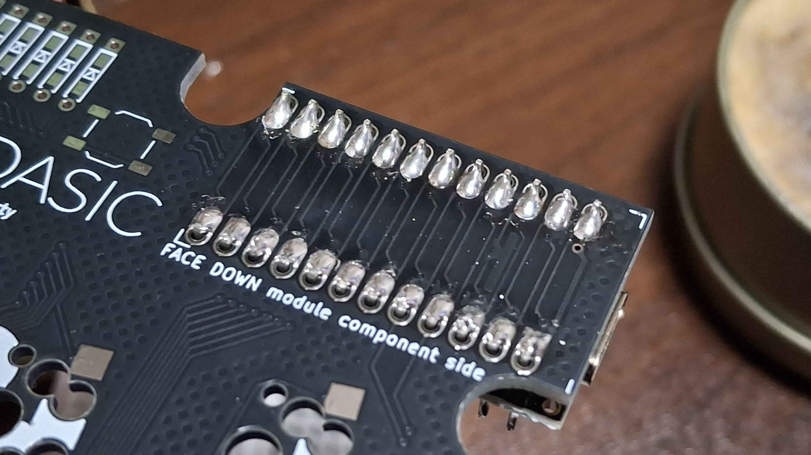
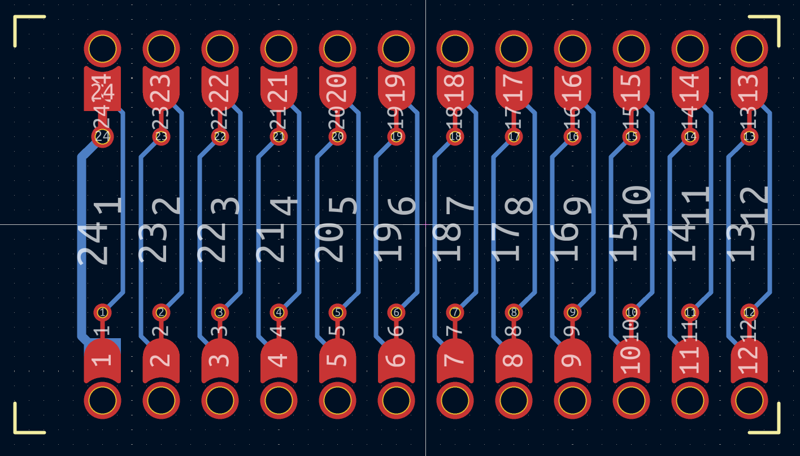
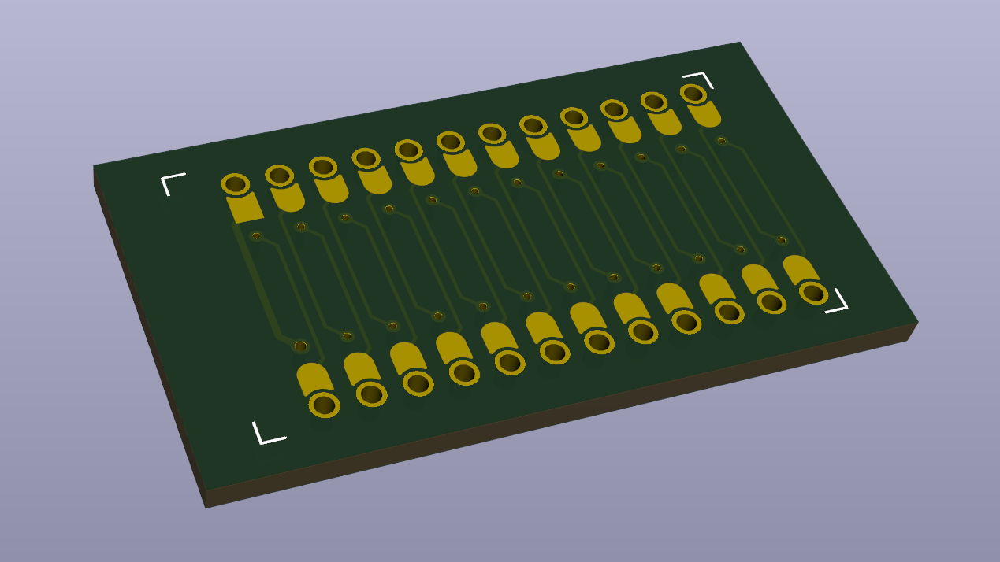

# Pro Micro Reversible Pad

this is KiCAD footprint for reversible PCB design.

- ReversiblePad: mounted with NPTH and pads, easier to wire.
- ReversibleThru: mounted with plated holes and pads, easier to solder.
- ComponentUp: mount promicro with the component side against the PCB.
- ComponentDown: mount promicro with the component side facing the PCB.
- OneSided/PadOnly: only provide one side of pads.
- ViaConnected: provided with vias, which connected with proper pads.
- ViaUnconnected: provided with vias, but unconnected.
- OuterPad: Pads are positioned outer side of promicro.

## ReversiblePad

## ReversibleThru

